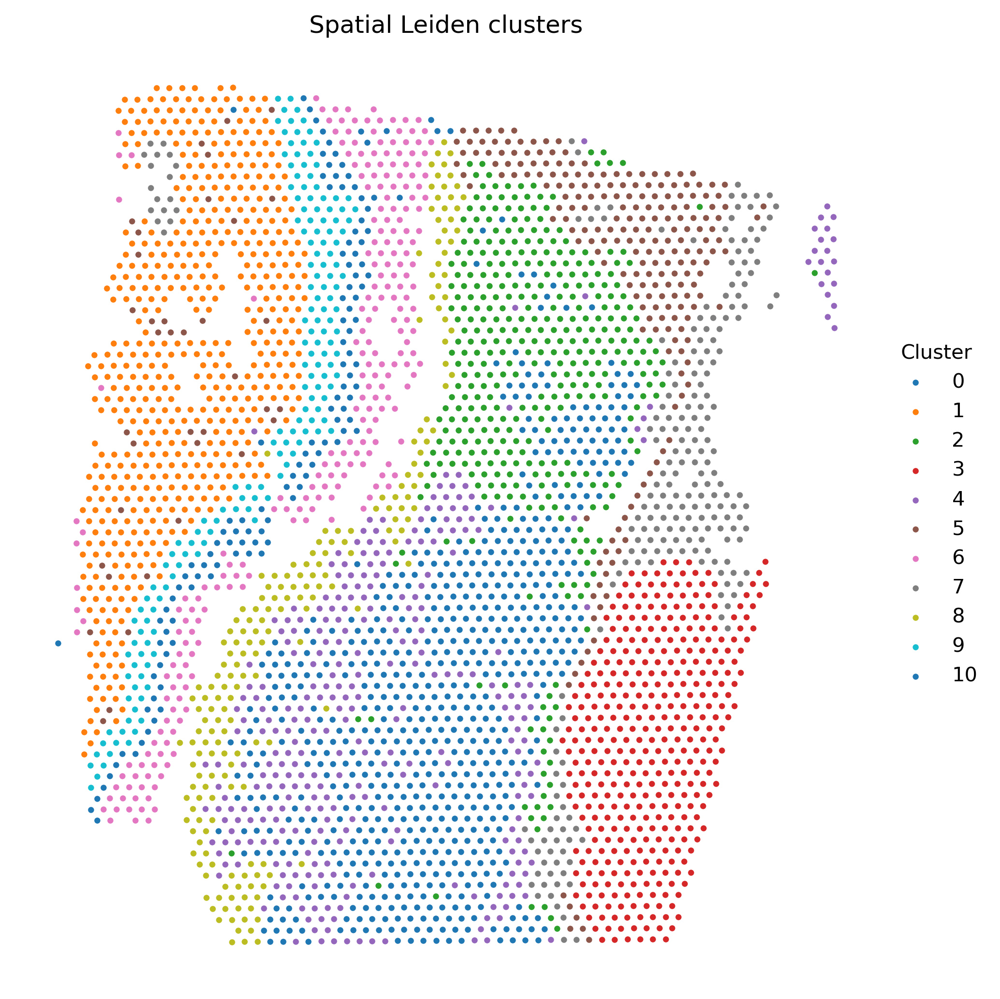
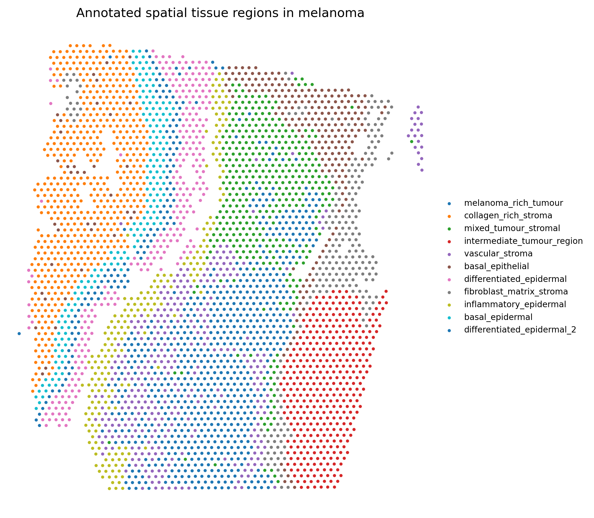

# Spatial organisation of tumour, stromal and immune programmes in human melanoma

Spatial transcriptomic mapping of tumour, stromal, and immune microenvironment programmes in human melanoma using 10x Genomics Visium data.

This repository implements a reproducible Snakemake workflow for analysing Visium spatial transcriptomics data and exploring how tumour-associated, stromal, and immune-associated transcriptional programmes are organised across melanoma tissue sections. The workflow integrates marker-based programme scoring, immune-state classification, spatial clustering, marker discovery, region annotation, and morphology-aware visualisation.

---

## Overview

Melanoma progression is influenced not only by tumour-intrinsic transcriptional programmes but also by interactions with stromal compartments and local immune populations. Spatial transcriptomics provides an opportunity to study these processes within their tissue context.

This workflow aims to:

- Identify melanoma-associated transcriptional territories.
- Characterise stromal and extracellular-matrix-rich regions.
- Map immune-associated transcriptional programmes.
- Classify spatial immune states.
- Discover region-specific marker genes.
- Visualise transcriptional programmes directly on tissue morphology.

---

## Workflow

```text
Visium spatial transcriptomics
            │
            ▼
      Preprocessing
            │
            ▼
     Marker scoring
            │
            ▼
 Immune-state classification
            │
            ▼
    Spatial clustering
            │
            ▼
     Marker discovery
            │
            ▼
    Region annotation
            │
            ▼
 Morphology-aware visualisation
```

---

## Example dataset

Human melanoma Visium dataset:

- Platform: 10x Genomics Visium
- Sample: CytAssist FFPE Human Skin Melanoma
- Tissue section containing melanoma, stromal compartments, and immune-associated regions

---

# Results

## Tissue morphology

Spatial transcriptomic measurements are interpreted in the context of the underlying tissue architecture.

<p align="center">
  
</p>

---

## Melanoma transcriptional programme

Spatial distribution of a melanoma-associated transcriptional signature based on:

- MLANA
- PMEL
- TYR
- MITF
- SOX10

Higher values indicate stronger melanoma-associated transcriptional activity.

<p align="center">
  
</p>

---

## Stromal programme

Spatial distribution of stromal and extracellular-matrix-associated transcriptional programmes.

Representative markers include:

- COL1A1
- COL3A1
- FN1
- FAP
- TGFB1

<p align="center">
  
</p>

---

## Interferon response

Spatial mapping of interferon-associated transcriptional activity.

Representative genes include:

- IFNG
- CXCL9
- CXCL10
- STAT1
- IRF1

<p align="center">
  
</p>

---

## Spatial immune states

Marker-based classification of local immune microenvironment states.

### Definitions

| State | Description |
|---------|---------|
| Immune-inflamed | Elevated T-cell and cytotoxic activity |
| Immune-excluded | Immune-associated signals concentrated outside tumour-rich regions |
| Immune-desert | Low immune-associated transcriptional activity |
| Immune niche | Localised immune-associated microenvironment |
| Unclassified | Regions not assigned to a specific immune state |

<p align="center">
  
</p>

---

# Spatial clustering

Leiden clustering was performed to identify spatially coherent transcriptional domains.

<p align="center">
  
</p>

---

# Region annotation

Spatial domains were annotated using cluster marker genes and tissue context.

Annotated regions include:

- Melanoma-rich tumour
- Collagen-rich stroma
- Fibroblast/matrix stroma
- Vascular stroma
- Basal epithelial regions
- Differentiated epidermal regions
- Intermediate tumour regions

<p align="center">
  
</p>

---

# Key findings

1. Melanoma-associated transcriptional programmes form spatially coherent tumour territories.

2. Stromal and extracellular-matrix programmes are enriched at tissue boundaries and connective-tissue structures.

3. Interferon-associated transcriptional activity exhibits spatial heterogeneity across the tissue section.

4. Multiple immune microenvironment states coexist within the same melanoma specimen.

5. Integration of tissue morphology and transcriptional programmes reveals spatial organisation of tumour, stromal, and immune compartments.

---

# Repository structure

```text
melanoma_spatial_immune_landscapes/
│
├── config.yaml
├── workflow/
│   └── Snakefile
│
├── metadata/
│   └── samples.tsv
│
├── scripts/
│
├── data/
│   └── raw/
│
├── results/
│   ├── h5ad/
│   ├── scored/
│   ├── classified/
│   ├── clustered/
│   ├── annotated/
│   └── markers/
│
└── figures/
    ├── morphology_overlays/
    ├── clustering/
    ├── annotations/
    └── immune_states/
```

---

# Reproducibility

The analysis is implemented as a reproducible Snakemake workflow.

Run the complete workflow:

```bash
snakemake --cores 4
```

Dry run:

```bash
snakemake -n
```

---

# Requirements

Major dependencies:

- Python
- Scanpy
- AnnData
- NumPy
- Pandas
- Matplotlib
- SciPy
- Snakemake

---

# Future directions

Planned extensions include:

- Multi-sample melanoma cohorts
- Spatial neighbourhood enrichment analysis
- Tumour–immune interface analysis
- Hot versus cold tumour quantification
- Squidpy-based spatial graph analysis
- Cross-sample spatial programme comparison

---

## Citation

If you use this repository please cite:

Juhász, Á. J. (2026). *Spatial organisation of tumour, stromal and immune programmes in human melanoma* [Computer software]. GitHub. https://github.com/agnjuh/melanoma_spatial_immune_landscapes
