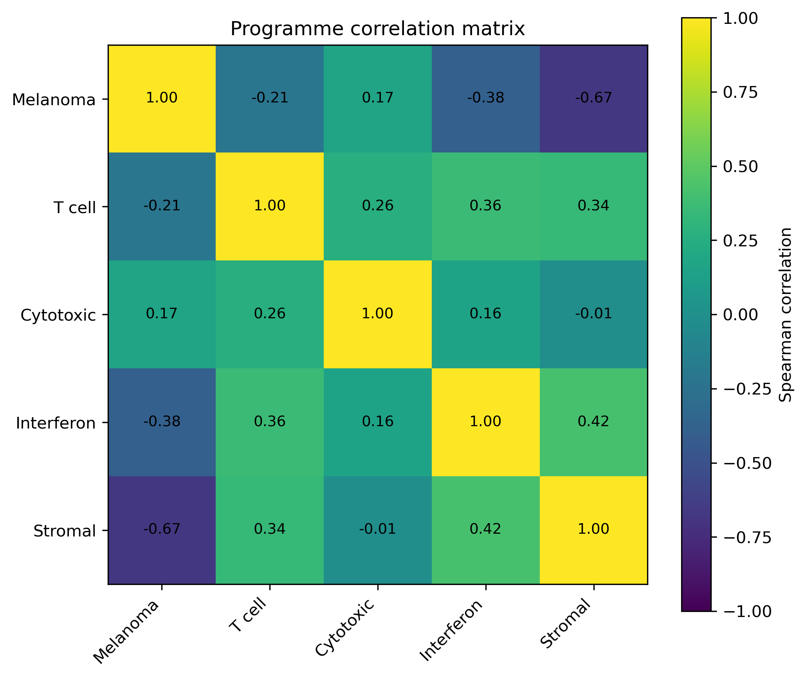
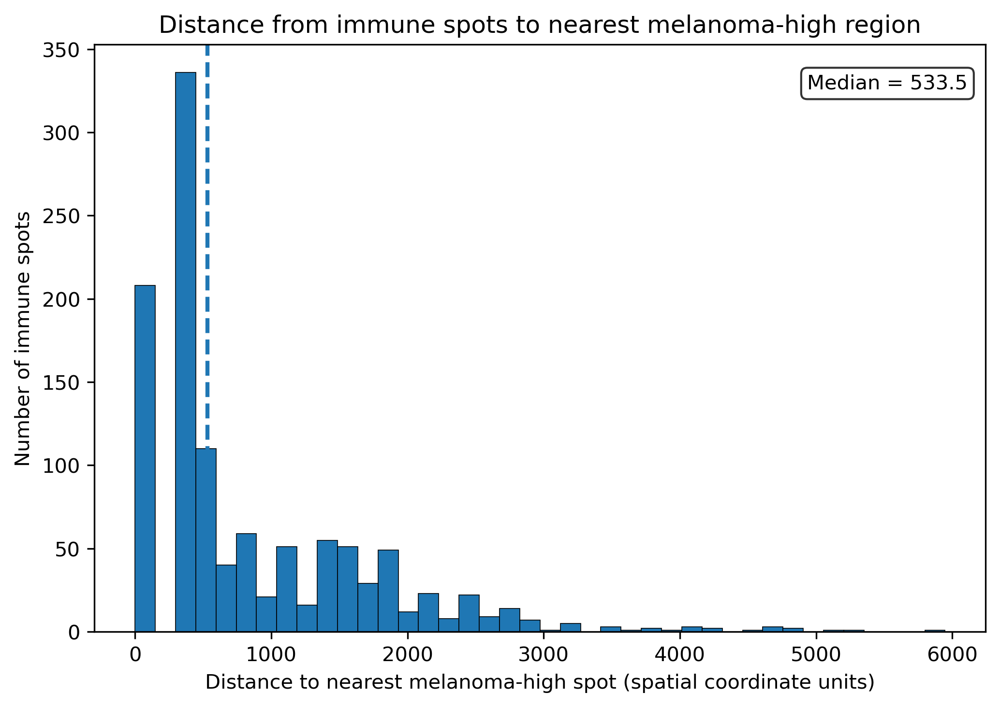
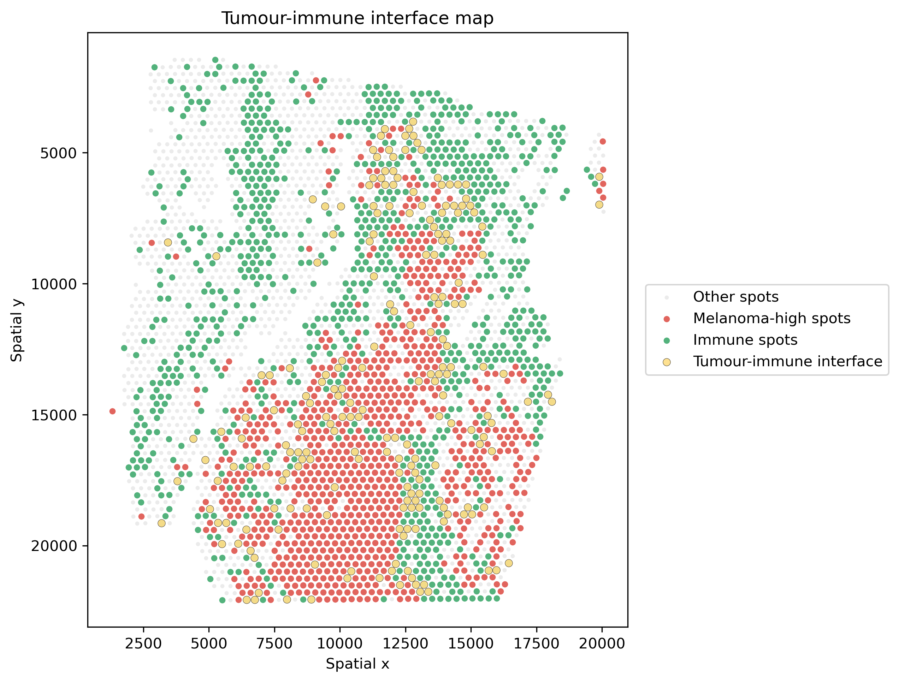

# Spatial organisation of tumour, stromal and immune programmes in human melanoma

This repository implements a reproducible Snakemake workflow for analysing Visium spatial transcriptomics data and exploring how tumour-associated, stromal, and immune-associated transcriptional programmes are organised across melanoma tissue sections.

The workflow integrates:

- Marker-based programme scoring
- Immune-state classification
- Spatial clustering
- Marker discovery
- Region annotation
- Morphology-aware visualisation
- Quantitative spatial analysis
- Tumour–immune interface analysis

---

## Overview

Melanoma progression is influenced not only by tumour-intrinsic transcriptional programmes but also by interactions with stromal compartments and local immune populations. Spatial transcriptomics provides an opportunity to study these processes within their tissue context.

This workflow aims to:

- Identify melanoma-associated transcriptional territories
- Characterise stromal and extracellular-matrix-rich regions
- Map immune-associated transcriptional programmes
- Classify spatial immune states
- Discover region-specific marker genes
- Quantify relationships between spatial programmes
- Identify tumour–immune interface regions
- Visualise transcriptional programmes directly on tissue morphology

---

## Workflow

```text
Visium spatial transcriptomics
            │
            ▼
      Preprocessing
            │
            ▼
     Marker scoring
            │
            ▼
 Immune-state classification
            │
            ▼
    Spatial clustering
            │
            ▼
     Marker discovery
            │
            ▼
    Region annotation
            │
            ▼
 Quantitative analysis
            │
            ▼
 Tumour–immune interface analysis
            │
            ▼
 Morphology-aware visualisation
```

---

## Example dataset

Human melanoma Visium dataset:

- Platform: 10x Genomics Visium
- Sample: CytAssist FFPE Human Skin Melanoma
- Tissue section containing melanoma, stromal compartments, and immune-associated regions

The workflow is designed to process one or multiple Visium samples defined in `metadata/samples.tsv`.

This repository currently includes a demonstration analysis of the 10x Genomics Human Skin Melanoma FFPE dataset.

---

# Results

## Tissue morphology

Spatial transcriptomic measurements are interpreted in the context of the underlying tissue architecture.

<p align="center">
  
</p>

---

## Melanoma transcriptional programme

Spatial distribution of a melanoma-associated transcriptional signature based on:

- MLANA
- PMEL
- TYR
- MITF
- SOX10

Higher values indicate stronger melanoma-associated transcriptional activity.

<p align="center">
  
</p>

---

## Stromal programme

Spatial distribution of stromal and extracellular-matrix-associated transcriptional programmes.

Representative markers include:

- COL1A1
- COL3A1
- FN1
- FAP
- TGFB1

<p align="center">
  
</p>

---

## Interferon response

Spatial mapping of interferon-associated transcriptional activity.

Representative genes include:

- IFNG
- CXCL9
- CXCL10
- STAT1
- IRF1

<p align="center">
  
</p>

---

## Spatial immune states

Marker-based classification of local immune microenvironment states.

### Definitions

| State | Description |
|---------|---------|
| Immune-inflamed | Elevated T-cell and cytotoxic activity |
| Immune-excluded | Immune-associated signals concentrated outside tumour-rich regions |
| Immune-desert | Low immune-associated transcriptional activity |
| Immune niche | Localised immune-associated microenvironment |
| Unclassified | Regions not assigned to a specific immune state |

<p align="center">
  
</p>

---

## Region annotation

Spatial domains were identified by Leiden clustering and annotated using marker genes and tissue context.

Annotated regions include:

- Melanoma-rich tumour
- Collagen-rich stroma
- Fibroblast/matrix stroma
- Vascular stroma
- Basal epithelial regions
- Differentiated epidermal regions
- Intermediate tumour regions

<p align="center">
  
</p>

---

# Quantitative spatial analysis

## Immune-state composition

The workflow summarises the number and proportion of spots assigned to each immune state.

Output:

```text
results/summary/{sample}_immune_state_summary.csv
```

Example melanoma tissue section:

| Immune state | Spots |
|-------------|-------:|
| Inflamed | 330 |
| Excluded | 18 |
| Desert | 1035 |
| Immune niche | 817 |
| Other | 1258 |

This demonstrates substantial spatial heterogeneity of immune-associated transcriptional programmes within a single melanoma specimen.

---

## Programme correlation structure

Spatial programme scores are compared using pairwise Spearman and Pearson correlation analyses.

Outputs:

```text
results/statistics/{sample}_programme_correlations.csv
figures/statistics/{sample}_correlation_heatmap.png
```

<p align="center">
  
</p>

Key observations from the demonstration dataset include:

- Strong negative spatial correlation between melanoma and stromal programmes
- Negative association between melanoma and interferon activity
- Positive association between T-cell and interferon programmes
- Positive association between stromal and interferon-associated activity

These results suggest spatial separation between melanoma-dominant and stromal/immune-associated regions.

---

# Tumour–immune interface analysis

The workflow identifies melanoma-high regions, immune-associated regions, and tumour–immune interface zones using spatial proximity relationships.

Melanoma-high spots are defined from the upper quantile of melanoma programme activity. Immune-associated spots are defined using immune-inflamed and immune-niche classifications.

Outputs:

```text
results/interface/{sample}_interface_distances.csv
results/interface/{sample}_interface_summary.csv

figures/interface/{sample}_distance_histogram.png
figures/interface/{sample}_interface_map.png
```

---

## Immune-to-tumour distance distribution

The distance from each immune-associated spot to its nearest melanoma-high region is quantified.

<p align="center">
  
</p>

Example statistics:

- Melanoma-high spots: 1038
- Immune-associated spots: 1147
- Interface spots: 208
- Interface fraction: 6.0%
- Median immune-to-tumour distance: 533.5 spatial units

The distribution indicates that while some immune populations occupy peritumoural regions, others remain spatially separated from melanoma-enriched territories.

---

## Tumour–immune interface map

Tumour-rich regions, immune-associated regions and interface zones can be visualised directly in spatial coordinates.

<p align="center">
  
</p>

Interface regions highlight local tumour–immune boundaries that may represent biologically relevant interaction zones.

---

## Key findings

1. Melanoma-associated transcriptional programmes form spatially coherent tumour territories.

2. Stromal and extracellular-matrix programmes occupy transcriptionally distinct spatial domains.

3. Interferon-associated activity exhibits substantial spatial heterogeneity across the tissue section.

4. Multiple immune microenvironment states coexist within the same melanoma specimen.

5. Melanoma and stromal programmes display strong spatial segregation.

6. T-cell and interferon-associated programmes show coordinated spatial organisation.

7. Tumour–immune interface regions can be identified and quantified using spatial proximity analysis.

8. Integration of tissue morphology and transcriptional programmes reveals complex spatial organisation of tumour, stromal and immune compartments.

---

## Repository structure

```text
melanoma_spatial_immune_landscapes/
│
├── config.yaml
├── workflow/
│   └── Snakefile
│
├── metadata/
│   └── samples.tsv
│
├── scripts/
│
├── data/
│   └── raw/
│
├── results/
│   ├── h5ad/
│   ├── scored/
│   ├── classified/
│   ├── clustered/
│   ├── annotated/
│   ├── markers/
│   ├── summary/
│   ├── statistics/
│   └── interface/
│
└── figures/
    ├── morphology_overlays/
    ├── annotations/
    ├── statistics/
    ├── interface/
    └── tissue_overlays/
```

---

## Reproducibility

The analysis is implemented as a fully reproducible Snakemake workflow.

Run the complete workflow:

```bash
snakemake --cores 4
```

Dry run:

```bash
snakemake -n
```

---

## Requirements

Major dependencies:

- Python
- Scanpy
- AnnData
- NumPy
- Pandas
- Matplotlib
- SciPy
- Snakemake

---

## Future directions

Planned extensions include:

- Multi-sample melanoma cohorts
- Spatial neighbourhood enrichment analysis
- Squidpy-based spatial graph analysis
- Tumour–stroma interaction modelling
- Hot versus cold tumour quantification
- Cross-sample spatial programme comparison
- Spatial autocorrelation analysis
- Cell-state neighbourhood mapping

---

## Citation

If you use this repository in academic work, please cite:

Juhász, Á. J. (2026). *Spatial organisation of tumour, stromal and immune programmes in human melanoma* [Computer software]. GitHub. https://github.com/agnjuh/melanoma_spatial_immune_landscapes